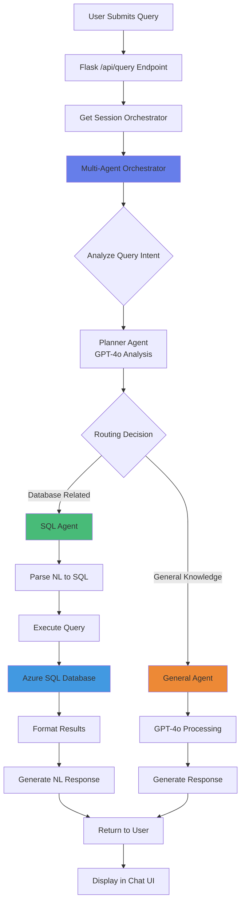
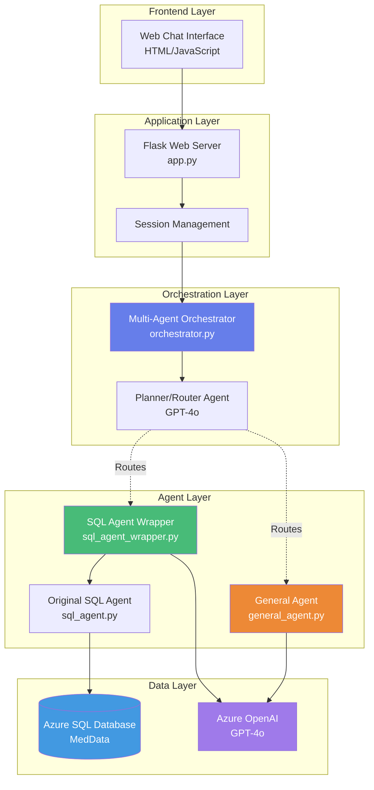
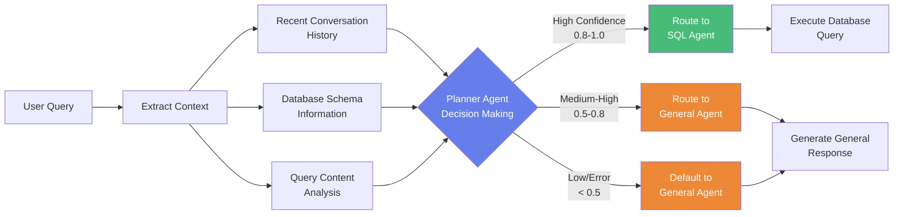
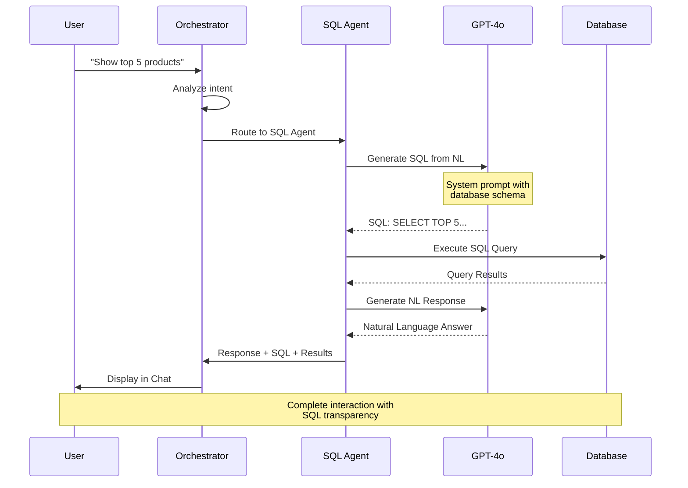
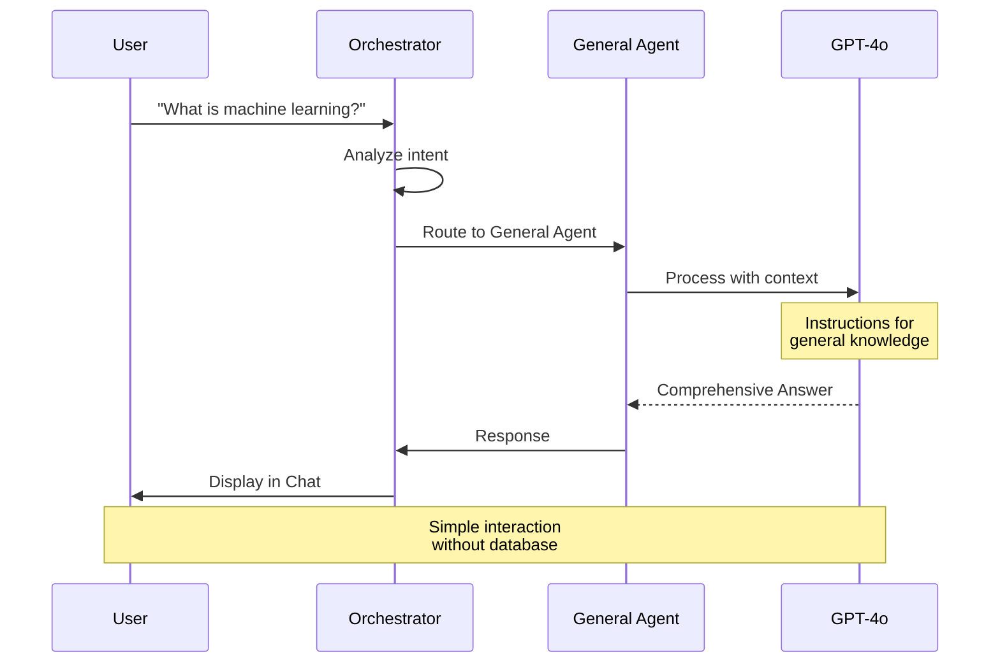
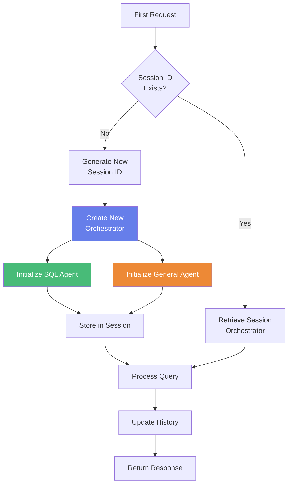
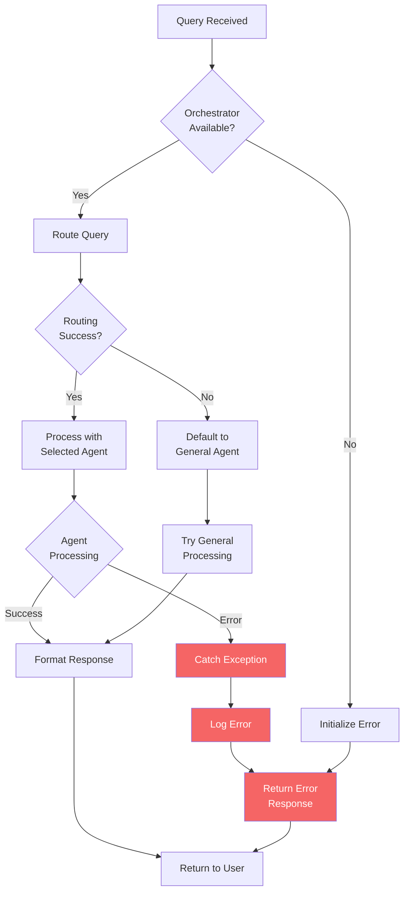
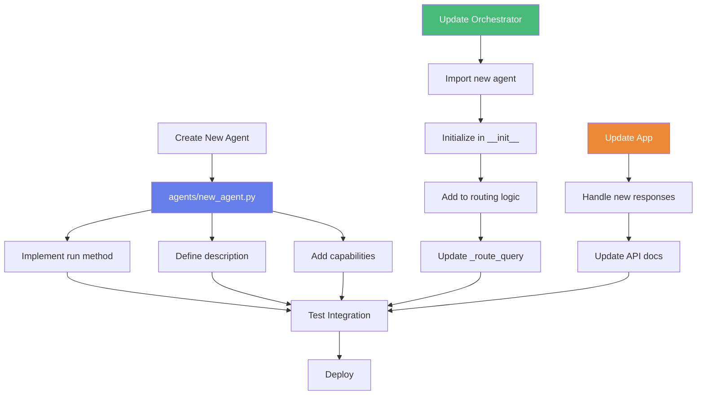

# System Flow Diagrams

## 1. Query Processing Flow



## 2. Multi-Agent Architecture



## 3. Routing Decision Process



## 4. SQL Agent Processing Flow



## 5. General Agent Processing Flow



## 6. Session Management



## 7. Error Handling Flow



## 8. Extension Pattern (Adding New Agent)



## 9. Data Flow - Complete Request

```
┌─────────────┐
│   Browser   │
└──────┬──────┘
       │ HTTP POST /api/query
       │ {"question": "Show all products"}
       ↓
┌──────────────────────────────────────┐
│     Flask Application (app.py)       │
│  • Validate request                  │
│  • Get/create session orchestrator   │
└──────┬───────────────────────────────┘
       │ Python object
       │ orchestrator.query(question)
       ↓
┌──────────────────────────────────────┐
│   Orchestrator (orchestrator.py)     │
│  • Call _route_query()               │
│  • Analyze: content + context        │
│  • Decision: SQL Agent (0.95 conf)   │
└──────┬───────────────────────────────┘
       │ async call
       │ sql_agent.process_query()
       ↓
┌──────────────────────────────────────┐
│   SQL Agent (sql_agent_wrapper.py)   │
│  • Extract question                  │
│  • Call wrapped SQL agent            │
└──────┬───────────────────────────────┘
       │ sync call
       │ sql_agent.query()
       ↓
┌──────────────────────────────────────┐
│  Original SQL Agent (sql_agent.py)   │
│  • Generate SQL via GPT-4o           │
│  • Execute on database               │
│  • Format results                    │
└──────┬───────────────────────────────┘
       │ Query result dict
       ↓
┌──────────────────────────────────────┐
│   SQL Agent Wrapper                  │
│  • Format as ChatMessage             │
│  • Add metadata                      │
└──────┬───────────────────────────────┘
       │ Result dict with agent info
       ↓
┌──────────────────────────────────────┐
│   Orchestrator                       │
│  • Add to conversation history       │
│  • Format complete response          │
└──────┬───────────────────────────────┘
       │ JSON response
       ↓
┌──────────────────────────────────────┐
│   Flask Application                  │
│  • jsonify response                  │
│  • Set HTTP headers                  │
└──────┬───────────────────────────────┘
       │ HTTP 200 OK
       │ JSON payload
       ↓
┌─────────────┐
│   Browser   │
│  • Display  │
│  • Update   │
└─────────────┘
```

## 10. Comparison: Before vs After

### Before (Single Agent)
```
User Query → SQL Agent → Database → Response
             (Limited to DB queries only)
```

### After (Multi-Agent)
```
                    ┌→ SQL Agent → Database → Response
User Query → Router ┤
                    └→ General Agent → AI → Response
                    (Handles all query types)
```

---

## Technical Notes

### Key Technologies Visualized

1. **Microsoft Agent Framework**: Orchestration backbone
2. **Azure OpenAI GPT-4o**: Intelligence layer (routing + processing)
3. **Python asyncio**: Asynchronous execution
4. **Flask**: Web framework
5. **Azure SQL Database**: Data persistence

### Design Patterns Used

1. **Wrapper Pattern**: SQL Agent wrapper around original agent
2. **Strategy Pattern**: Different agents for different query types
3. **Factory Pattern**: create_orchestrator_from_env()
4. **Observer Pattern**: Session-based orchestrator instances
5. **Chain of Responsibility**: Routing through orchestrator

### Performance Characteristics

- **Routing Decision**: ~0.5-1.0 seconds (GPT-4o call)
- **SQL Query**: ~0.5-2.0 seconds (depends on query complexity)
- **General Response**: ~1.0-2.0 seconds (GPT-4o generation)
- **Total Latency**: 1.0-3.0 seconds average

---

**Repository**: https://github.com/patmeh1/MAF_SqlAgent_demo
**Last Updated**: October 29, 2025
